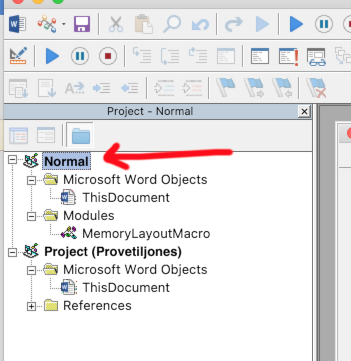

# Memory-style Table from words - in Word!
Make memory game style cards with Microsoft Word using this VBA Macro.

# what does it do ??

## INPUT: 

It takes text in `in a word document!` the following format:
`1*one*
2*two*
3*three*
4*four*
5*five*
6*six*
7*seven*
8*eight*
9*nine*
10*ten*
11*eleven*
` etc.

In other words bits of text separated by the asterisk sign * - and it handles them `AS PAIRS` (look at the first example) It doesn't care about line breaks or stuff like that.

## OUTPUT:
It makes `a new document` with `THE PAIRS` on tiles on adjacent pages so that when printed on double sides of a piece of paper, each pair will correspond. See example here:

So make sure that your document has the correct format, otherwise it won't work.

# HOW DO I DO IT?

## Downloading the macro file:
1. First double click the file `MemoryMacro_JonasRyan_01.bas` in this folder and
2. click on this button to download the file - make sure you `notice where you store it on you computer` 

## Importing the file into Word

1. Open word on any document. Go here:

2. Then the Visual Basic Editor shows up, and be sure to press on the `Normal` in the folder structure here: 

3. Then import it into normal folder like this:  and then choose the file wher eyou stored it.

4. Now your normal folder should have the file `MemoryLayoutMacro` in it's module folder like on the picture above. 
5. NOW SAVE INSIDE THIS EDITOR. PRESS `ctrl-S` or `cmd-S` depending on your operating system, or just do it in the menu in the top.
6. when you have saved, you can close the editor again and return to word.

# Running the Macro in word
When you have imported the macro into the normal folder you should be able to find it the following way:

1. open your document with the text containing the pairs you want mapped out (in the right format mind you)
2. Go here: 
3. this should show up: 
4. if it doesn show up, try changing the `Macros in:` fild to Normal, like this: 
4. Click `Run` and it should do the thing
5. Remember to save the new document
6. Honk.